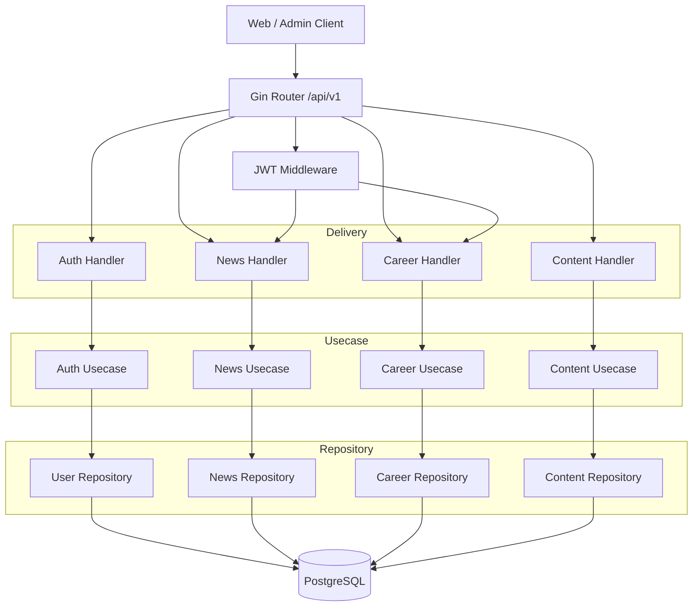
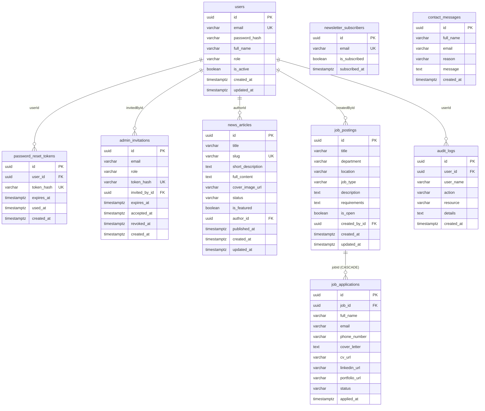
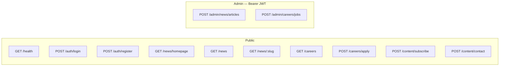
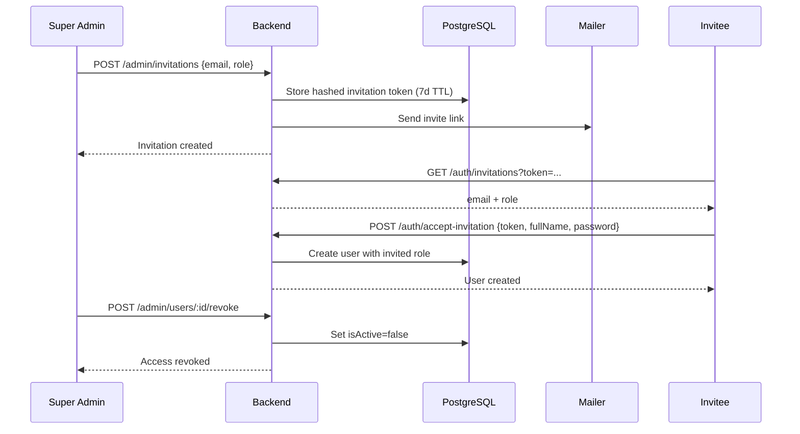
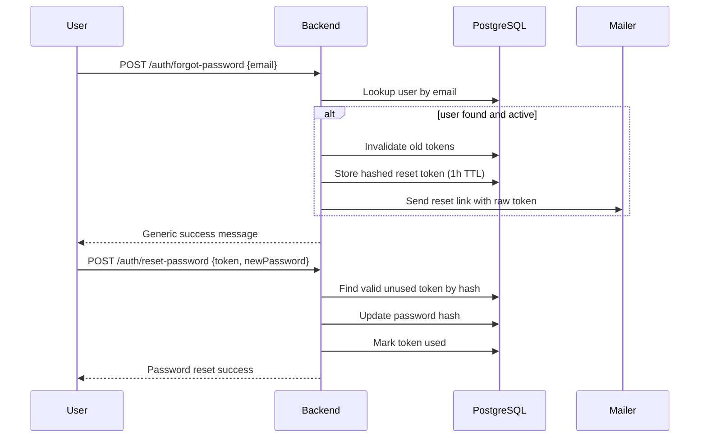

# AddisPay Backend

Go API for the AddisPay public website and admin content management.

| Item | Value |
|------|--------|
| Module | `github.com/addispay/backend` |
| Runtime | Go 1.26+ |
| HTTP | Gin |
| ORM | GORM + PostgreSQL |
| Base URL | `http://localhost:8000/api/v1` |
| Auth | JWT Bearer (`HS256`, 24h expiry) |

## Quick start

```bash
cd backend
# Create .env from the Environment section below
go mod tidy
go run ./cmd/api
```

Health check:

```bash
curl http://localhost:8000/api/v1/health
```

---

## Architecture

Clean Architecture per domain: **delivery (HTTP) → usecase → repository → PostgreSQL**.



### Package layout

```text
backend/
├── cmd/api/main.go              # DI wiring + server start
└── internal/
    ├── config/                  # Env-based configuration
    ├── database/                # GORM connect + AutoMigrate
    ├── response/                # Success / error JSON helpers
    ├── server/router.go         # Route registration
    ├── auth/                    # Users, login, register, JWT
    ├── news/                    # News articles
    ├── careers/                 # Jobs + applications
    └── content/                 # Newsletter, contact, audit log
```

Each domain follows:

```text
domain/ → repository/ → usecase/ → delivery/http/
```

---

## Database schema

PostgreSQL. Primary keys are UUIDs (`gen_random_uuid()`). Tables are created via GORM `AutoMigrate` on startup.

### ER diagram



### Tables

#### `users`

| Column | Type | Constraints | JSON |
|--------|------|-------------|------|
| `id` | UUID | PK, default `gen_random_uuid()` | `id` |
| `email` | varchar(255) | unique, not null | `email` |
| `password_hash` | varchar(255) | not null | *(omitted)* |
| `full_name` | varchar(255) | not null | `fullName` |
| `role` | varchar(50) | not null, default `Marketer` | `role` |
| `is_active` | boolean | default `true` | `isActive` |
| `created_at` | timestamp | auto | `createdAt` |
| `updated_at` | timestamp | auto | `updatedAt` |

**Roles:** `Super_Admin` · `Marketer` · `HR`

#### `password_reset_tokens`

| Column | Type | Constraints | JSON |
|--------|------|-------------|------|
| `id` | UUID | PK | `id` |
| `user_id` | UUID | not null, indexed → `users.id` | `userId` |
| `token_hash` | varchar(64) | unique, not null (SHA-256 hex) | *(omitted)* |
| `expires_at` | timestamp | not null, indexed | `expiresAt` |
| `used_at` | timestamp | nullable | `usedAt` |
| `created_at` | timestamp | | `createdAt` |

#### `admin_invitations`

| Column | Type | Constraints | JSON |
|--------|------|-------------|------|
| `id` | UUID | PK | `id` |
| `email` | varchar(255) | not null, indexed | `email` |
| `role` | varchar(50) | not null (`Marketer` / `HR`) | `role` |
| `token_hash` | varchar(64) | unique, not null | *(omitted)* |
| `invited_by_id` | UUID | not null → `users.id` | `invitedById` |
| `expires_at` | timestamp | not null | `expiresAt` |
| `accepted_at` | timestamp | nullable | `acceptedAt` |
| `revoked_at` | timestamp | nullable | `revokedAt` |
| `created_at` | timestamp | | `createdAt` |

#### `news_articles`

| Column | Type | Constraints | JSON |
|--------|------|-------------|------|
| `id` | UUID | PK | `id` |
| `title` | varchar(255) | not null | `title` |
| `slug` | varchar(255) | unique, not null | `slug` |
| `short_description` | text | not null | `shortDescription` |
| `full_content` | text | not null | `fullContent` |
| `cover_image_url` | varchar(500) | optional | `coverImageUrl` |
| `status` | varchar(50) | default `DRAFT` | `status` |
| `is_featured` | boolean | default false, indexed | `isFeatured` |
| `author_id` | UUID | not null → `users.id` | `authorId` |
| `published_at` | timestamp | nullable | `publishedAt` |
| `created_at` / `updated_at` | timestamp | | `createdAt` / `updatedAt` |

**Status:** `DRAFT` · `PUBLISHED`

Slug is generated from title (`lower` + spaces → `-`).

#### `job_postings`

| Column | Type | Constraints | JSON |
|--------|------|-------------|------|
| `id` | UUID | PK | `id` |
| `title` | varchar(255) | not null | `title` |
| `department` | varchar(255) | not null | `department` |
| `location` | varchar(255) | not null | `location` |
| `job_type` | varchar(50) | default `FULL_TIME` | `jobType` |
| `description` | text | not null | `description` |
| `requirements` | text | not null | `requirements` |
| `is_open` | boolean | default `true` | `isOpen` |
| `created_by_id` | UUID | not null → `users.id` | `createdById` |
| `created_at` / `updated_at` | timestamp | | `createdAt` / `updatedAt` |

**Job types:** `FULL_TIME` · `PART_TIME` · `REMOTE`

#### `job_applications`

| Column | Type | Constraints | JSON |
|--------|------|-------------|------|
| `id` | UUID | PK | `id` |
| `job_id` | UUID | not null, indexed, CASCADE delete | `jobId` |
| `full_name` | varchar(255) | not null | `fullName` |
| `email` | varchar(255) | not null | `email` |
| `phone_number` | varchar(50) | not null | `phoneNumber` |
| `cover_letter` | text | not null | `coverLetter` |
| `cv_url` | varchar(500) | not null | `cvUrl` |
| `linkedin_url` | varchar(500) | optional | `linkedinUrl` |
| `portfolio_url` | varchar(500) | optional | `portfolioUrl` |
| `status` | varchar(50) | default `PENDING` | `status` |
| `applied_at` | timestamp | | `appliedAt` |

**Application status:** `PENDING` · `REVIEWED` · `SHORTLISTED` · `REJECTED`

#### `newsletter_subscribers`

| Column | Type | Constraints | JSON |
|--------|------|-------------|------|
| `id` | UUID | PK | `id` |
| `email` | varchar(255) | unique, not null | `email` |
| `is_subscribed` | boolean | default `true` | `isSubscribed` |
| `subscribed_at` | timestamp | | `subscribedAt` |

#### `contact_messages`

| Column | Type | Constraints | JSON |
|--------|------|-------------|------|
| `id` | UUID | PK | `id` |
| `full_name` | varchar(255) | not null | `fullName` |
| `email` | varchar(255) | not null | `email` |
| `reason` | varchar(255) | not null | `reason` |
| `message` | text | not null | `message` |
| `created_at` | timestamp | | `createdAt` |

#### `audit_logs`

| Column | Type | Constraints | JSON |
|--------|------|-------------|------|
| `id` | UUID | PK | `id` |
| `user_id` | UUID | not null | `userId` |
| `user_name` | varchar(255) | not null | `userName` |
| `action` | varchar(100) | not null | `action` |
| `resource` | varchar(255) | not null | `resource` |
| `details` | text | optional | `details` |
| `created_at` | timestamp | | `createdAt` |

> Migrated in DB; no HTTP routes expose audit logs yet.

---

## API route map



| Method | Path | Auth | Handler |
|--------|------|------|---------|
| `GET` | `/api/v1/health` | Public | Health |
| `POST` | `/api/v1/auth/login` | Public | Login |
| `POST` | `/api/v1/auth/register` | Public | Bootstrap first Super Admin only |
| `POST` | `/api/v1/auth/forgot-password` | Public | Request password reset |
| `POST` | `/api/v1/auth/reset-password` | Public | Reset password with token |
| `GET` | `/api/v1/auth/invitations?token=` | Public | Preview invitation (email + role) |
| `POST` | `/api/v1/auth/accept-invitation` | Public | Accept invite + set password |
| `POST` | `/api/v1/admin/invitations` | Super Admin JWT | Invite Marketer / HR |
| `GET` | `/api/v1/admin/invitations` | Super Admin JWT | List pending invitations |
| `DELETE` | `/api/v1/admin/invitations/:id` | Super Admin JWT | Cancel invitation |
| `GET` | `/api/v1/admin/users` | Super Admin JWT | List administrators |
| `POST` | `/api/v1/admin/users/:id/revoke` | Super Admin JWT | Revoke access (`isActive=false`) |
| `POST` | `/api/v1/admin/users/:id/restore` | Super Admin JWT | Restore access |
| `GET` | `/api/v1/news/homepage` | Public | Homepage news |
| `GET` | `/api/v1/news` | Public | News listing |
| `GET` | `/api/v1/news/:slug` | Public | Article by slug |
| `GET` | `/api/v1/careers` | Public | Open jobs |
| `POST` | `/api/v1/careers/apply` | Public | Apply for job |
| `POST` | `/api/v1/content/subscribe` | Public | Newsletter |
| `POST` | `/api/v1/content/contact` | Public | Contact form |
| `POST` | `/api/v1/admin/news/articles` | Super Admin / Marketer | Create article |
| `POST` | `/api/v1/admin/careers/jobs` | Super Admin / HR | Create job |

---

## Response format

Most handlers use:

**Success**

```json
{
  "success": true,
  "data": {}
}
```

**Error**

```json
{
  "success": false,
  "error": "message"
}
```

Exceptions:

- `GET /health` → `{ "status": "UP", "engine": "GORM" }`
- JWT middleware errors → `{ "error": "..." }` (no `success` field)

### Authentication

```http
Authorization: Bearer <jwt>
```

JWT claims (from login):

| Claim | Meaning |
|-------|---------|
| `sub` | User UUID |
| `email` | User email |
| `role` | `Super_Admin` \| `Marketer` \| `HR` |
| `exp` | Expiry (Unix, +24h) |

---

## API documentation

### Health

#### `GET /api/v1/health`

**Response `200`**

```json
{
  "status": "UP",
  "engine": "GORM"
}
```

---

### Auth

#### `POST /api/v1/auth/login`

**Body**

```json
{
  "email": "admin@addispay.com",
  "password": "secret"
}
```

**Response `200`**

```json
{
  "success": true,
  "data": {
    "token": "<jwt>",
    "user": {
      "id": "uuid",
      "email": "admin@addispay.com",
      "fullName": "Admin User",
      "role": "Super_Admin",
      "isActive": true,
      "createdAt": "...",
      "updatedAt": "..."
    }
  }
}
```

| Status | When |
|--------|------|
| `400` | Invalid JSON |
| `401` | Invalid email or password |

---

#### `POST /api/v1/auth/register`

Bootstraps the **first** Super Admin only. After that, Marketer / HR accounts are created via invitation.

**Body**

```json
{
  "fullName": "Jane Doe",
  "email": "jane@addispay.com",
  "password": "secret123",
  "role": "Super_Admin"
}
```

| Status | When |
|--------|------|
| `400` | Users already exist, wrong role, or invalid payload |

---

#### `POST /api/v1/auth/forgot-password`

Requests a password reset email. Always returns the same success message whether or not the account exists (prevents email enumeration).

**Body**

```json
{
  "email": "admin@addispay.com"
}
```

**Response `200`**

```json
{
  "success": true,
  "data": {
    "message": "If an account exists for that email, a password reset link has been sent"
  }
}
```

Reset tokens:

- Cryptographically random (32 bytes, hex-encoded)
- Stored as SHA-256 hash only
- Expire after **1 hour**
- Single-use; previous unused tokens for the user are invalidated
- Reset link format: `{FRONTEND_URL}/reset-password?token=<rawToken>`

In local development without SMTP, `LogMailer` prints the reset link to the server logs.

| Status | When |
|--------|------|
| `400` | Missing/invalid email payload |
| `500` | Unexpected failure while creating/sending reset |

---

#### `POST /api/v1/auth/reset-password`

Completes a password reset using the token from the email/link.

**Body**

```json
{
  "token": "<raw-token-from-email>",
  "newPassword": "newSecurePass1"
}
```

Password must be at least **8 characters**.

**Response `200`**

```json
{
  "success": true,
  "data": {
    "message": "Password has been reset successfully"
  }
}
```

| Status | When |
|--------|------|
| `400` | Invalid/expired token, short password, or bad payload |

---

### Admin invitations (Super Admin)

Super Admin invites Marketer or HR by email. The invitee opens the link, sets a password, and their account is created with that role. Access can be revoked later (`isActive = false`).



#### `POST /api/v1/admin/invitations`

Requires Super Admin JWT.

**Body**

```json
{
  "email": "marketer@addispay.com",
  "role": "Marketer"
}
```

`role` must be `Marketer` or `HR` (not `Super_Admin`).

Invite link: `{FRONTEND_URL}/accept-invitation?token=<rawToken>`. TTL: **7 days**. Previous pending invites for the same email are revoked. With SMTP configured the link is emailed; otherwise it is logged.

**Response `201`** — invitation object (token hash omitted).

---

#### `GET /api/v1/admin/invitations`

Lists pending (unused, unrevoked, unexpired) invitations.

---

#### `DELETE /api/v1/admin/invitations/:id`

Cancels a pending invitation.

---

#### `GET /api/v1/auth/invitations?token=<rawToken>`

Public preview for the accept-invitation page.

**Response `200`**

```json
{
  "success": true,
  "data": {
    "email": "marketer@addispay.com",
    "role": "Marketer",
    "expiresAt": "..."
  }
}
```

---

#### `POST /api/v1/auth/accept-invitation`

**Body**

```json
{
  "token": "<raw-token-from-email>",
  "fullName": "New Marketer",
  "password": "securePass1"
}
```

**Response `201`** — created `User` with the invited role.

---

#### `GET /api/v1/admin/users`

Lists all administrators.

---

#### `POST /api/v1/admin/users/:id/revoke`

Deactivates a Marketer or HR account. They can no longer log in. Cannot revoke Super Admin or yourself.

---

#### `POST /api/v1/admin/users/:id/restore`

Reactivates a previously revoked Marketer or HR account.

---

### News (public)

#### `GET /api/v1/news/homepage`

Returns featured article + latest published articles (up to 4).

**Response `200`**

```json
{
  "success": true,
  "data": {
    "featured": { },
    "latest": [ ]
  }
}
```

---

#### `GET /api/v1/news`

**Query**

| Param | Default | Description |
|-------|---------|-------------|
| `page` | `1` | Page number |
| `limit` | `10` | Page size |
| `search` | — | ILIKE on title / short description |

**Response `200`**

```json
{
  "success": true,
  "data": {
    "articles": [ ],
    "total": 0
  }
}
```

Only `PUBLISHED` articles are returned.

---

#### `GET /api/v1/news/:slug`

**Response `200`** — `data` is a `NewsArticle`.

| Status | When |
|--------|------|
| `404` | Article not found |

---

### News (admin)

#### `POST /api/v1/admin/news/articles`

Requires JWT with role **Super_Admin** or **Marketer**.

**Body**

```json
{
  "title": "Product launch",
  "shortDescription": "Short summary",
  "fullContent": "Full rich text body",
  "coverImageUrl": "https://cdn.example.com/cover.jpg",
  "isFeatured": true,
  "status": "PUBLISHED"
}
```

`status`: `DRAFT` | `PUBLISHED`  
If `isFeatured` is true, other featured flags are cleared.  
If `PUBLISHED`, `publishedAt` is set to now.  
`authorId` comes from the JWT `sub` claim.  
`slug` is derived from `title`.

**Response `201`** — `data` is the created `NewsArticle`.

---

### Careers (public)

#### `GET /api/v1/careers`

**Response `200`** — `data` is an array of open `JobPosting` (`isOpen = true`).

---

#### `POST /api/v1/careers/apply`

**Body**

```json
{
  "jobId": "uuid",
  "fullName": "Applicant Name",
  "email": "applicant@email.com",
  "phoneNumber": "+2519...",
  "coverLetter": "Why I want this role",
  "cvUrl": "https://...",
  "linkedinUrl": "https://...",
  "portfolioUrl": "https://..."
}
```

**Response `201`** — `data` is the created `JobApplication` (`status: PENDING`).

| Status | When |
|--------|------|
| `400` | Invalid payload, bad job ID, or job not open |

---

### Careers (admin)

#### `POST /api/v1/admin/careers/jobs`

Requires JWT with role **Super_Admin** or **HR**.

**Body**

```json
{
  "title": "Backend Engineer",
  "department": "Engineering",
  "location": "Addis Ababa",
  "jobType": "FULL_TIME",
  "description": "Role overview",
  "requirements": "Go, PostgreSQL, ..."
}
```

`jobType`: `FULL_TIME` | `PART_TIME` | `REMOTE`  
`createdById` comes from JWT `sub`. New jobs are created with `isOpen: true`.

**Response `201`** — `data` is the created `JobPosting`.

---

### Content

#### `POST /api/v1/content/subscribe`

**Body**

```json
{
  "email": "user@email.com"
}
```

Upserts subscriber; re-subscribe sets `isSubscribed = true`.

**Response `200`**

```json
{
  "success": true,
  "data": {
    "message": "Newsletter subscription successful"
  }
}
```

---

#### `POST /api/v1/content/contact`

**Body**

```json
{
  "fullName": "Visitor Name",
  "email": "visitor@email.com",
  "reason": "Partnership",
  "message": "Hello AddisPay..."
}
```

**Response `201`**

```json
{
  "success": true,
  "data": {
    "message": "Message sent successfully"
  }
}
```

---

## Environment

Create `backend/.env` (do not commit secrets):

| Variable | Default | Description |
|----------|---------|-------------|
| `PORT` | `8000` | HTTP listen port |
| `DB_HOST` | `localhost` | PostgreSQL host |
| `DB_PORT` | `5432` | PostgreSQL port |
| `DB_USER` | *(empty)* | DB user |
| `DB_PASSWORD` | *(empty)* | DB password |
| `DB_NAME` | *(empty)* | Database name |
| `DB_SSLMODE` | `verify-full` | SSL mode (`disable` for local) |
| `ADDISPAY_JWT_SUPER_SECRET_KEY_2026` | *(empty)* | JWT signing secret |
| `FRONTEND_URL` | `http://localhost:3000` | Base URL for password-reset / invite links |
| `UPLOAD_DIR` | `./uploads` | Upload path (reserved; unused by routes yet) |
| `SMTP_HOST` | *(empty)* | SMTP server host (empty = LogMailer) |
| `SMTP_PORT` | `587` | SMTP port (587 STARTTLS recommended) |
| `SMTP_USERNAME` | *(empty)* | SMTP auth username |
| `SMTP_PASSWORD` | *(empty)* | SMTP auth password / app password |
| `SMTP_FROM` | *(empty)* | From header, e.g. `AddisPay <noreply@domain.com>` |

DSN timezone: `Africa/Addis_Ababa`.  
Pool: max idle 10, max open 100, conn max lifetime 1h.

Example local `.env`:

```env
PORT=8000
DB_HOST=localhost
DB_PORT=5432
DB_USER=your_user
DB_PASSWORD=your_password
DB_NAME=addispay_db
DB_SSLMODE=disable
ADDISPAY_JWT_SUPER_SECRET_KEY_2026=replace-with-a-long-random-secret
FRONTEND_URL=http://localhost:3000
UPLOAD_DIR=./uploads
SMTP_HOST=smtp.gmail.com
SMTP_PORT=587
SMTP_USERNAME=your@gmail.com
SMTP_PASSWORD=your-app-password
SMTP_FROM=AddisPay <your@gmail.com>
```

If `SMTP_HOST` is empty, the server uses **LogMailer** and prints reset/invite links to stdout.

### SMTP notes

- Port `587` with username/password uses STARTTLS via Go `net/smtp`.
- Gmail: enable 2FA and create an [App Password](https://myaccount.google.com/apppasswords); use that as `SMTP_PASSWORD`.
- On startup you should see either `[mailer] using SMTP ...` or `[mailer] SMTP not configured — using LogMailer`.

---

## Password reset flow



---

## Example requests

```bash
# Health
curl http://localhost:8000/api/v1/health

# Register
curl -X POST http://localhost:8000/api/v1/auth/register \
  -H 'Content-Type: application/json' \
  -d '{"fullName":"Admin","email":"admin@addispay.com","password":"secret","role":"Super_Admin"}'

# Login
curl -X POST http://localhost:8000/api/v1/auth/login \
  -H 'Content-Type: application/json' \
  -d '{"email":"admin@addispay.com","password":"secret"}'

# Forgot password (check server logs for reset link when using LogMailer)
curl -X POST http://localhost:8000/api/v1/auth/forgot-password \
  -H 'Content-Type: application/json' \
  -d '{"email":"admin@addispay.com"}'

# Reset password
curl -X POST http://localhost:8000/api/v1/auth/reset-password \
  -H 'Content-Type: application/json' \
  -d '{"token":"<raw-token>","newPassword":"newSecurePass1"}'

# Invite Marketer (Super Admin)
curl -X POST http://localhost:8000/api/v1/admin/invitations \
  -H 'Content-Type: application/json' \
  -H "Authorization: Bearer $TOKEN" \
  -d '{"email":"marketer@addispay.com","role":"Marketer"}'

# Accept invitation
curl -X POST http://localhost:8000/api/v1/auth/accept-invitation \
  -H 'Content-Type: application/json' \
  -d '{"token":"<invite-token>","fullName":"New Marketer","password":"securePass1"}'

# Revoke administrator access
curl -X POST http://localhost:8000/api/v1/admin/users/<user-id>/revoke \
  -H "Authorization: Bearer $TOKEN"

# Public news
curl 'http://localhost:8000/api/v1/news?page=1&limit=10'

# Create article (admin)
curl -X POST http://localhost:8000/api/v1/admin/news/articles \
  -H 'Content-Type: application/json' \
  -H "Authorization: Bearer $TOKEN" \
  -d '{"title":"Launch","shortDescription":"Summary","fullContent":"Body","isFeatured":true,"status":"PUBLISHED"}'
```

---

## Role-based access control

| Role | News admin APIs | Careers admin APIs | Invite / revoke users |
|------|-----------------|--------------------|------------------------|
| `Super_Admin` | Yes | Yes | Yes |
| `Marketer` | Yes | No (`403`) | No (`403`) |
| `HR` | No (`403`) | Yes | No (`403`) |

Public website APIs (read news, list jobs, apply, contact, subscribe) remain open to everyone.

Unauthorized role → `403` `{ "success": false, "error": "Insufficient permissions" }`

---

## Current gaps (for implementers)

| Area | Status |
|------|--------|
| Edit / delete news | Usecase/repo methods exist; **no HTTP routes** |
| Get profile | Usecase exists; **no route** |
| Audit log API | Table migrated; **no routes** |
| File upload | `UPLOAD_DIR` configured; **no upload endpoint** |

---

## Validation

```bash
go mod tidy
go build ./...
go test ./...
```
