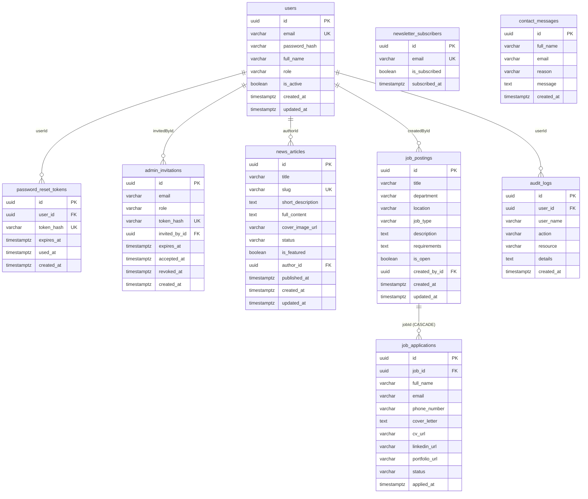
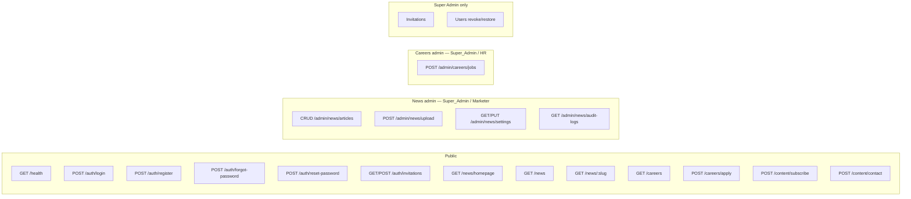
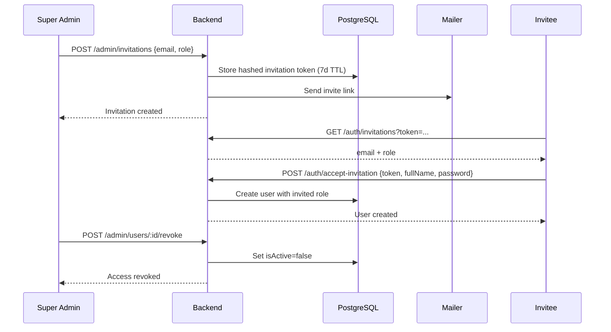
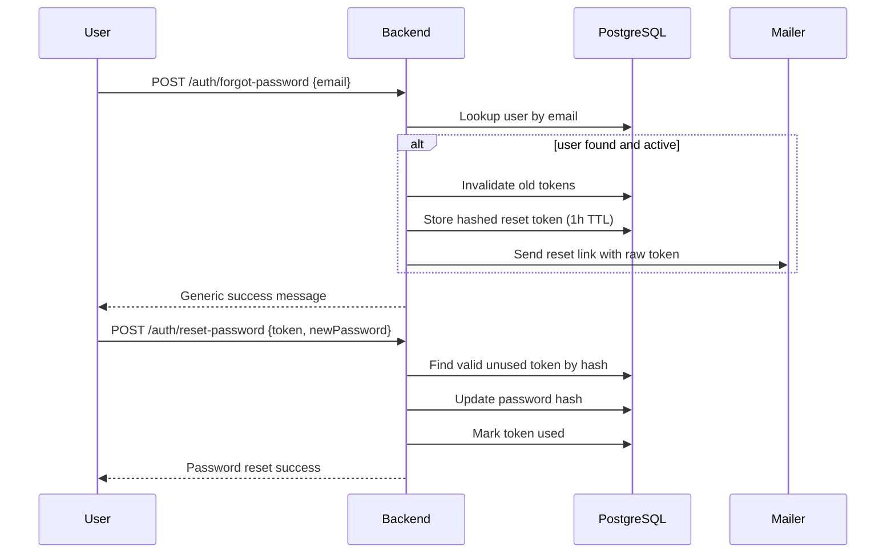

# AddisPay Backend

Go API for the AddisPay public website and admin content management.

| Item     | Value                                                                    |
| -------- | ------------------------------------------------------------------------ |
| Module   | `github.com/addispay/backend`                                            |
| Runtime  | Go 1.26+                                                                 |
| HTTP     | Gin                                                                      |
| ORM      | GORM + PostgreSQL                                                        |
| Base URL | `http://localhost:8080/api/v1`                                           |
| Auth     | JWT Bearer (`HS256`, 4h expiry; role/`isActive` re-checked each request) |

## Quick start

````bash
cd backend
# Create .env from the Environment section below
go mod tidy
go run ./cmd/api

Health check:

```bash
curl http://localhost:8000/api/v1/health

---

## Architecture

Clean Architecture per domain: **delivery (HTTP) → usecase → repository → PostgreSQL**.

```mermaid
flowchart TB
  Client[Web / Admin Client]
  Router[Gin Router /api/v1]
  MW[JWT Middleware]

  subgraph Delivery
    AuthH[Auth Handler]
    NewsH[News Handler]
    CareerH[Career Handler]
    ContentH[Content Handler]
  end

  subgraph Usecase
    AuthUC[Auth Usecase]
    NewsUC[News Usecase]
    CareerUC[Career Usecase]
    ContentUC[Content Usecase]
  end

  subgraph Repository
    AuthRepo[User Repository]
    NewsRepo[News Repository]
    CareerRepo[Career Repository]
    ContentRepo[Content Repository]
  end

  DB[(PostgreSQL)]

  Client --> Router
  Router --> AuthH
  Router --> NewsH
  Router --> CareerH
  Router --> ContentH
  Router --> MW
  MW --> NewsH
  MW --> CareerH

  AuthH --> AuthUC --> AuthRepo --> DB
  NewsH --> NewsUC --> NewsRepo --> DB
  CareerH --> CareerUC --> CareerRepo --> DB
  ContentH --> ContentUC --> ContentRepo --> DB
````

### Package layout

```text
backend/
├── cmd/api/main.go              # DI wiring + server start
├── .env / .env.example          # Local config (never commit secrets)
├── uploads/                     # Cover images (created at runtime)
└── internal/
    ├── config/                  # Env-based configuration
    ├── database/                # GORM connect + AutoMigrate
    ├── response/                # Success / error JSON helpers
    ├── server/router.go         # Route registration + /uploads static
    ├── auth/                    # Users, JWT, invites, password reset, SMTP mailer
    ├── news/                    # News CRUD, upload + image optimize
    ├── careers/                 # Jobs + applications
    └── content/                 # Newsletter, contact, audit logs, site settings
```

Each domain follows:

```text
domain/ → repository/ → usecase/ → delivery/http/
```

---

## Database schema

PostgreSQL. Primary keys are UUIDs (`gen_random_uuid()`). Tables are created via GORM `AutoMigrate` on startup.

### ER diagram



### Tables

#### `users`

| Column          | Type         | Constraints                     | JSON        |
| --------------- | ------------ | ------------------------------- | ----------- |
| `id`            | UUID         | PK, default `gen_random_uuid()` | `id`        |
| `email`         | varchar(255) | unique, not null                | `email`     |
| `password_hash` | varchar(255) | not null                        | _(omitted)_ |
| `full_name`     | varchar(255) | not null                        | `fullName`  |
| `role`          | varchar(50)  | not null, default `Marketer`    | `role`      |
| `is_active`     | boolean      | default `true`                  | `isActive`  |
| `created_at`    | timestamp    | auto                            | `createdAt` |
| `updated_at`    | timestamp    | auto                            | `updatedAt` |

**Roles:** `Super_Admin` · `Marketer` · `HR`

#### `password_reset_tokens`

| Column       | Type        | Constraints                    | JSON        |
| ------------ | ----------- | ------------------------------ | ----------- |
| `id`         | UUID        | PK                             | `id`        |
| `user_id`    | UUID        | not null, indexed → `users.id` | `userId`    |
| `token_hash` | varchar(64) | unique, not null (SHA-256 hex) | _(omitted)_ |
| `expires_at` | timestamp   | not null, indexed              | `expiresAt` |
| `used_at`    | timestamp   | nullable                       | `usedAt`    |
| `created_at` | timestamp   |                                | `createdAt` |

#### `admin_invitations`

| Column          | Type         | Constraints                  | JSON          |
| --------------- | ------------ | ---------------------------- | ------------- |
| `id`            | UUID         | PK                           | `id`          |
| `email`         | varchar(255) | not null, indexed            | `email`       |
| `role`          | varchar(50)  | not null (`Marketer` / `HR`) | `role`        |
| `token_hash`    | varchar(64)  | unique, not null             | _(omitted)_   |
| `invited_by_id` | UUID         | not null → `users.id`        | `invitedById` |
| `expires_at`    | timestamp    | not null                     | `expiresAt`   |
| `accepted_at`   | timestamp    | nullable                     | `acceptedAt`  |
| `revoked_at`    | timestamp    | nullable                     | `revokedAt`   |
| `created_at`    | timestamp    |                              | `createdAt`   |

#### `news_articles`

| Column                      | Type         | Constraints            | JSON                      |
| --------------------------- | ------------ | ---------------------- | ------------------------- |
| `id`                        | UUID         | PK                     | `id`                      |
| `title`                     | varchar(255) | not null               | `title`                   |
| `slug`                      | varchar(255) | unique, not null       | `slug`                    |
| `short_description`         | text         | not null               | `shortDescription`        |
| `full_content`              | text         | not null               | `fullContent`             |
| `cover_image_url`           | varchar(500) | optional               | `coverImageUrl`           |
| `status`                    | varchar(50)  | default `DRAFT`        | `status`                  |
| `is_featured`               | boolean      | default false, indexed | `isFeatured`              |
| `author_id`                 | UUID         | not null → `users.id`  | `authorId`                |
| `published_at`              | timestamp    | nullable               | `publishedAt`             |
| `created_at` / `updated_at` | timestamp    |                        | `createdAt` / `updatedAt` |

**Status:** `DRAFT` · `PUBLISHED`

Slug is generated from title (`lower` + spaces → `-`).

#### `job_postings`

| Column                      | Type         | Constraints           | JSON                      |
| --------------------------- | ------------ | --------------------- | ------------------------- |
| `id`                        | UUID         | PK                    | `id`                      |
| `title`                     | varchar(255) | not null              | `title`                   |
| `department`                | varchar(255) | not null              | `department`              |
| `location`                  | varchar(255) | not null              | `location`                |
| `job_type`                  | varchar(50)  | default `FULL_TIME`   | `jobType`                 |
| `description`               | text         | not null              | `description`             |
| `requirements`              | text         | not null              | `requirements`            |
| `is_open`                   | boolean      | default `true`        | `isOpen`                  |
| `created_by_id`             | UUID         | not null → `users.id` | `createdById`             |
| `created_at` / `updated_at` | timestamp    |                       | `createdAt` / `updatedAt` |

**Job types:** `FULL_TIME` · `PART_TIME` · `REMOTE`

#### `job_applications`

| Column          | Type         | Constraints                       | JSON           |
| --------------- | ------------ | --------------------------------- | -------------- |
| `id`            | UUID         | PK                                | `id`           |
| `job_id`        | UUID         | not null, indexed, CASCADE delete | `jobId`        |
| `full_name`     | varchar(255) | not null                          | `fullName`     |
| `email`         | varchar(255) | not null                          | `email`        |
| `phone_number`  | varchar(50)  | not null                          | `phoneNumber`  |
| `cover_letter`  | text         | not null                          | `coverLetter`  |
| `cv_url`        | varchar(500) | not null                          | `cvUrl`        |
| `linkedin_url`  | varchar(500) | optional                          | `linkedinUrl`  |
| `portfolio_url` | varchar(500) | optional                          | `portfolioUrl` |
| `status`        | varchar(50)  | default `PENDING`                 | `status`       |
| `applied_at`    | timestamp    |                                   | `appliedAt`    |

**Application status:** `PENDING` · `REVIEWED` · `SHORTLISTED` · `REJECTED`

#### `newsletter_subscribers`

| Column          | Type         | Constraints      | JSON           |
| --------------- | ------------ | ---------------- | -------------- |
| `id`            | UUID         | PK               | `id`           |
| `email`         | varchar(255) | unique, not null | `email`        |
| `is_subscribed` | boolean      | default `true`   | `isSubscribed` |
| `subscribed_at` | timestamp    |                  | `subscribedAt` |

#### `contact_messages`

| Column       | Type         | Constraints | JSON        |
| ------------ | ------------ | ----------- | ----------- |
| `id`         | UUID         | PK          | `id`        |
| `full_name`  | varchar(255) | not null    | `fullName`  |
| `email`      | varchar(255) | not null    | `email`     |
| `reason`     | varchar(255) | not null    | `reason`    |
| `message`    | text         | not null    | `message`   |
| `created_at` | timestamp    |             | `createdAt` |

#### `audit_logs`

| Column       | Type         | Constraints | JSON        |
| ------------ | ------------ | ----------- | ----------- |
| `id`         | UUID         | PK          | `id`        |
| `user_id`    | UUID         | not null    | `userId`    |
| `user_name`  | varchar(255) | not null    | `userName`  |
| `action`     | varchar(100) | not null    | `action`    |
| `resource`   | varchar(255) | not null    | `resource`  |
| `details`    | text         | optional    | `details`   |
| `created_at` | timestamp    |             | `createdAt` |

> Migrated in DB; no HTTP routes expose audit logs yet.

---

## API route map



| Method   | Path                                            | Auth                   | Handler                                |
| -------- | ----------------------------------------------- | ---------------------- | -------------------------------------- |
| `GET`    | `/api/v1/health`                                | Public                 | Health                                 |
| `POST`   | `/api/v1/auth/login`                            | Public                 | Login                                  |
| `POST`   | `/api/v1/auth/register`                         | Public                 | Bootstrap first Super Admin only       |
| `POST`   | `/api/v1/auth/forgot-password`                  | Public                 | Request password reset                 |
| `POST`   | `/api/v1/auth/reset-password`                   | Public                 | Reset password with token              |
| `GET`    | `/api/v1/auth/invitations?token=`               | Public                 | Preview invitation (email + role)      |
| `POST`   | `/api/v1/auth/accept-invitation`                | Public                 | Accept invite + set password           |
| `POST`   | `/api/v1/admin/invitations`                     | Super Admin JWT        | Invite Marketer / HR                   |
| `GET`    | `/api/v1/admin/invitations`                     | Super Admin JWT        | List pending invitations               |
| `DELETE` | `/api/v1/admin/invitations/:id`                 | Super Admin JWT        | Cancel invitation                      |
| `GET`    | `/api/v1/admin/users`                           | Super Admin JWT        | List administrators                    |
| `POST`   | `/api/v1/admin/users/:id/revoke`                | Super Admin JWT        | Revoke access (`isActive=false`)       |
| `POST`   | `/api/v1/admin/users/:id/restore`               | Super Admin JWT        | Restore access                         |
| `GET`    | `/api/v1/news/homepage`                         | Public                 | Homepage news                          |
| `GET`    | `/api/v1/news`                                  | Public                 | News listing                           |
| `GET`    | `/api/v1/news/:slug`                            | Public                 | Article by slug                        |
| `GET`    | `/api/v1/careers`                               | Public                 | Open jobs                              |
| `POST`   | `/api/v1/careers/apply`                         | Public                 | Apply for job                          |
| `POST`   | `/api/v1/content/subscribe`                     | Public                 | Newsletter                             |
| `POST`   | `/api/v1/content/contact`                       | Public                 | Contact form                           |
| `POST`   | `/api/v1/admin/news/articles`                   | Super Admin / Marketer | Create article                         |
| `GET`    | `/api/v1/admin/news/articles`                   | Super Admin / Marketer | List all articles (incl. drafts)       |
| `GET`    | `/api/v1/admin/news/articles/:id`               | Super Admin / Marketer | Get article by ID                      |
| `PUT`    | `/api/v1/admin/news/articles/:id`               | Super Admin / Marketer | Edit / publish / unpublish             |
| `DELETE` | `/api/v1/admin/news/articles/:id`               | Super Admin / Marketer | Delete article                         |
| `POST`   | `/api/v1/admin/news/upload`                     | Super Admin / Marketer | Upload cover image                     |
| `GET`    | `/api/v1/admin/news/settings`                   | Super Admin / Marketer | Homepage limit + empty message         |
| `PUT`    | `/api/v1/admin/news/settings`                   | Super Admin / Marketer | Update news settings                   |
| `GET`    | `/api/v1/admin/news/audit-logs`                 | Super Admin / Marketer | News activity audit trail              |
| `POST`   | `/api/v1/admin/careers/jobs`                    | Super Admin / HR       | Create job                             |
| `GET`    | `/api/v1/admin/careers/jobs`                    | Super Admin / HR       | List all jobs (open + closed)          |
| `GET`    | `/api/v1/admin/careers/jobs/:id`                | Super Admin / HR       | Get job by ID                          |
| `PUT`    | `/api/v1/admin/careers/jobs/:id`                | Super Admin / HR       | Update / open / close job              |
| `DELETE` | `/api/v1/admin/careers/jobs/:id`                | Super Admin / HR       | Delete job                             |
| `GET`    | `/api/v1/admin/careers/applications`            | Super Admin / HR       | List applications (`?jobId=` optional) |
| `PUT`    | `/api/v1/admin/careers/applications/:id/status` | Super Admin / HR       | Update application status              |
| `GET`    | `/api/v1/admin/careers/audit-logs`              | Super Admin / HR       | Careers audit trail                    |

---

## Response format

Most handlers use:

**Success**

```json
{
  "success": true,
  "data": {}
}
```

**Error**

```json
{
  "success": false,
  "error": "message"
}
```

Exceptions:

- `GET /health` → `{ "status": "UP", "engine": "GORM" }`
- JWT middleware errors → `{ "error": "..." }` (no `success` field)

### Authentication

```http
Authorization: Bearer <jwt>
```

JWT claims (from login):

| Claim   | Meaning                             |
| ------- | ----------------------------------- |
| `sub`   | User UUID                           |
| `email` | User email                          |
| `role`  | `Super_Admin` \| `Marketer` \| `HR` |
| `exp`   | Expiry (Unix, +4h)                  |

---

## API documentation

### Health

#### `GET /api/v1/health`

**Response `200`**

```json
{
  "status": "UP",
  "engine": "GORM"
}
```

---

### Auth

#### `POST /api/v1/auth/login`

**Body**

```json
{
  "email": "admin@addispay.com",
  "password": "secret"
}
```

**Response `200`**

```json
{
  "success": true,
  "data": {
    "token": "<jwt>",
    "user": {
      "id": "uuid",
      "email": "admin@addispay.com",
      "fullName": "Admin User",
      "role": "Super_Admin",
      "isActive": true,
      "createdAt": "...",
      "updatedAt": "..."
    }
  }
}
```

| Status | When                      |
| ------ | ------------------------- |
| `400`  | Invalid JSON              |
| `401`  | Invalid email or password |

---

#### `POST /api/v1/auth/register`

Bootstraps the **first** Super Admin only. After that, Marketer / HR accounts are created via invitation.

**Body**

```json
{
  "fullName": "Jane Doe",
  "email": "jane@addispay.com",
  "password": "secret123",
  "role": "Super_Admin"
}
```

| Status | When                                                |
| ------ | --------------------------------------------------- |
| `400`  | Users already exist, wrong role, or invalid payload |

---

#### `POST /api/v1/auth/forgot-password`

Requests a password reset email. Always returns the same success message whether or not the account exists (prevents email enumeration).

**Body**

```json
{
  "email": "admin@addispay.com"
}
```

**Response `200`**

```json
{
  "success": true,
  "data": {
    "message": "If an account exists for that email, a password reset link has been sent"
  }
}
```

Reset tokens:

- Cryptographically random (32 bytes, hex-encoded)
- Stored as SHA-256 hash only
- Expire after **1 hour**
- Single-use; previous unused tokens for the user are invalidated
- Reset link format: `{FRONTEND_URL}/reset-password?token=<rawToken>`

In local development without SMTP, `LogMailer` prints the reset link to the server logs.

| Status | When                                            |
| ------ | ----------------------------------------------- |
| `400`  | Missing/invalid email payload                   |
| `500`  | Unexpected failure while creating/sending reset |

---

#### `POST /api/v1/auth/reset-password`

Completes a password reset using the token from the email/link.

**Body**

```json
{
  "token": "<raw-token-from-email>",
  "newPassword": "newSecurePass1"
}
```

Password must be at least **8 characters**.

**Response `200`**

```json
{
  "success": true,
  "data": {
    "message": "Password has been reset successfully"
  }
}
```

| Status | When                                                  |
| ------ | ----------------------------------------------------- |
| `400`  | Invalid/expired token, short password, or bad payload |

---

### Admin invitations (Super Admin)

Super Admin invites Marketer or HR by email. The invitee opens the link, sets a password, and their account is created with that role. Access can be revoked later (`isActive = false`).



#### `POST /api/v1/admin/invitations`

Requires Super Admin JWT.

**Body**

```json
{
  "email": "marketer@addispay.com",
  "role": "Marketer"
}
```

`role` must be `Marketer` or `HR` (not `Super_Admin`).

Invite link: `{FRONTEND_URL}/accept-invitation?token=<rawToken>`. TTL: **7 days**. Previous pending invites for the same email are revoked. With SMTP configured the link is emailed; otherwise it is logged.

**Response `201`** — invitation object (token hash omitted).

---

#### `GET /api/v1/admin/invitations`

Lists pending (unused, unrevoked, unexpired) invitations.

---

#### `DELETE /api/v1/admin/invitations/:id`

Cancels a pending invitation.

---

#### `GET /api/v1/auth/invitations?token=<rawToken>`

Public preview for the accept-invitation page.

**Response `200`**

```json
{
  "success": true,
  "data": {
    "email": "marketer@addispay.com",
    "role": "Marketer",
    "expiresAt": "..."
  }
}
```

---

#### `POST /api/v1/auth/accept-invitation`

**Body**

```json
{
  "token": "<raw-token-from-email>",
  "fullName": "New Marketer",
  "password": "securePass1"
}
```

**Response `201`** — created `User` with the invited role.

---

#### `GET /api/v1/admin/users`

Lists all administrators.

---

#### `POST /api/v1/admin/users/:id/revoke`

Deactivates a Marketer or HR account. They can no longer log in. Cannot revoke Super Admin or yourself.

---

#### `POST /api/v1/admin/users/:id/restore`

Reactivates a previously revoked Marketer or HR account.

---

### News (public)

#### `GET /api/v1/news/homepage`

Returns featured article + latest published articles (up to 4).

**Response `200`**

```json
{
  "success": true,
  "data": {
    "featured": {},
    "latest": []
  }
}
```

---

#### `GET /api/v1/news`

**Query**

| Param    | Default | Description                        |
| -------- | ------- | ---------------------------------- |
| `page`   | `1`     | Page number                        |
| `limit`  | `10`    | Page size                          |
| `search` | —       | ILIKE on title / short description |

**Response `200`**

```json
{
  "success": true,
  "data": {
    "articles": [],
    "total": 0
  }
}
```

Only `PUBLISHED` articles are returned.

---

#### `GET /api/v1/news/:slug`

**Response `200`** — `data` is a `NewsArticle`.

| Status | When              |
| ------ | ----------------- |
| `404`  | Article not found |

---

### News (admin)

#### `POST /api/v1/admin/news/articles`

Requires JWT with role **Super_Admin** or **Marketer**.

**Body**

```json
{
  "title": "Product launch",
  "shortDescription": "Short summary",
  "fullContent": "<p>Rich HTML body</p>",
  "coverImageUrl": "/uploads/news/....jpg",
  "isFeatured": true,
  "status": "PUBLISHED"
}
```

`status`: `DRAFT` | `PUBLISHED`  
If `isFeatured` is true, other featured flags are cleared.  
If `PUBLISHED`, `publishedAt` is set to now.  
`authorId` comes from the JWT `sub` claim.  
`slug` is derived from `title`.

**Response `201`** — `data` is the created `NewsArticle`.

---

#### `GET /api/v1/admin/news/articles`

Admin list (drafts + published). Query: `page`, `limit`, `search`, `status` (`DRAFT`|`PUBLISHED`).

---

#### `GET /api/v1/admin/news/articles/:id`

Fetch any article by UUID (including drafts).

---

#### `PUT /api/v1/admin/news/articles/:id`

Partial update. Changing `status` publishes or unpublishes. Logs `EDIT` / `PUBLISH` / `UNPUBLISH`.

---

#### `DELETE /api/v1/admin/news/articles/:id`

Permanently deletes the article and logs `DELETE`.

---

#### `POST /api/v1/admin/news/upload`

Multipart form field `file`. Allowed: JPG, JPEG, PNG, WebP. Max **5 MB**.

Uploaded images are automatically optimized for web delivery: EXIF orientation is applied, images wider than **1600px** are downscaled (aspect preserved), and the result is re-encoded as JPEG (quality 82). Output is always `.jpg`.

**Response `201`**

```json
{
  "success": true,
  "data": {
    "url": "/uploads/news/....jpg",
    "filename": "....jpg",
    "optimizedSize": 148213
  }
}
```

Use `data.url` as `coverImageUrl` when creating/updating articles. Files are served at `http://localhost:8000/uploads/...`.

---

#### `GET` / `PUT /api/v1/admin/news/settings`

```json
{ "homepageLimit": 4, "emptyMessage": "No news available at this time." }
```

`homepageLimit` controls how many latest articles `/news/homepage` returns (1–20). `emptyMessage` is returned to the frontend for empty states.

---

#### `GET /api/v1/admin/news/audit-logs`

Paginated audit trail (`page`, `limit`). Each log: admin id/name, action (`CREATE`|`EDIT`|`PUBLISH`|`UNPUBLISH`|`DELETE`), resource `news`, article title, timestamp.

---

### Careers (admin)

Requires JWT with role **Super_Admin** or **HR** (Career Manager).

| Method   | Path                                     | Notes                                          |
| -------- | ---------------------------------------- | ---------------------------------------------- |
| `GET`    | `/admin/careers/jobs`                    | All jobs                                       |
| `GET`    | `/admin/careers/jobs/:id`                | One job                                        |
| `POST`   | `/admin/careers/jobs`                    | Create (open by default)                       |
| `PUT`    | `/admin/careers/jobs/:id`                | Partial update; `isOpen: false` closes posting |
| `DELETE` | `/admin/careers/jobs/:id`                | Permanent delete (cascades applications)       |
| `GET`    | `/admin/careers/applications?jobId=`     | All apps, or filter by job                     |
| `PUT`    | `/admin/careers/applications/:id/status` | `{ "status": "REVIEWED" }` etc.                |
| `GET`    | `/admin/careers/audit-logs`              | CREATE / EDIT / CLOSE / OPEN / DELETE          |

**Create body**

```json
{
  "title": "Backend Engineer",
  "department": "Engineering",
  "location": "Addis Ababa",
  "jobType": "FULL_TIME",
  "description": "Build APIs",
  "requirements": "Go, PostgreSQL"
}
```

**Update / close body**

```json
{
  "title": "Senior Backend Engineer",
  "isOpen": false
}
```

**Application status values:** `PENDING` · `REVIEWED` · `SHORTLISTED` · `REJECTED`

---

### Careers (public)

#### `GET /api/v1/careers`

**Response `200`** — `data` is an array of open `JobPosting` (`isOpen = true`).

---

#### `POST /api/v1/careers/apply`

**Body**

```json
{
  "jobId": "uuid",
  "fullName": "Applicant Name",
  "email": "applicant@email.com",
  "phoneNumber": "+2519...",
  "coverLetter": "Why I want this role",
  "cvUrl": "https://...",
  "linkedinUrl": "https://...",
  "portfolioUrl": "https://..."
}
```

**Response `201`** — `data` is the created `JobApplication` (`status: PENDING`).

| Status | When                                         |
| ------ | -------------------------------------------- |
| `400`  | Invalid payload, bad job ID, or job not open |

---

### Careers (admin)

#### `POST /api/v1/admin/careers/jobs`

Requires JWT with role **Super_Admin** or **HR**.

**Body**

```json
{
  "title": "Backend Engineer",
  "department": "Engineering",
  "location": "Addis Ababa",
  "jobType": "FULL_TIME",
  "description": "Role overview",
  "requirements": "Go, PostgreSQL, ..."
}
```

`jobType`: `FULL_TIME` | `PART_TIME` | `REMOTE`  
`createdById` comes from JWT `sub`. New jobs are created with `isOpen: true`.

**Response `201`** — `data` is the created `JobPosting`.

---

### Content

#### `POST /api/v1/content/subscribe`

**Body**

```json
{
  "email": "user@email.com"
}
```

Upserts subscriber; re-subscribe sets `isSubscribed = true`.

**Response `200`**

```json
{
  "success": true,
  "data": {
    "message": "Newsletter subscription successful"
  }
}
```

---

#### `POST /api/v1/content/contact`

**Body**

```json
{
  "fullName": "Visitor Name",
  "email": "visitor@email.com",
  "reason": "Partnership",
  "message": "Hello AddisPay..."
}
```

**Response `201`**

```json
{
  "success": true,
  "data": {
    "message": "Message sent successfully"
  }
}
```

---

## Environment

Create `backend/.env` (do not commit secrets):

| Variable                             | Default                 | Description                                                           |
| ------------------------------------ | ----------------------- | --------------------------------------------------------------------- |
| `PORT`                               | `8000`                  | HTTP listen port                                                      |
| `DB_HOST`                            | `localhost`             | PostgreSQL host                                                       |
| `DB_PORT`                            | `5432`                  | PostgreSQL port                                                       |
| `DB_USER`                            | _(empty)_               | DB user                                                               |
| `DB_PASSWORD`                        | _(empty)_               | DB password                                                           |
| `DB_NAME`                            | _(empty)_               | Database name                                                         |
| `DB_SSLMODE`                         | `verify-full`           | SSL mode (`disable` for local)                                        |
| `ADDISPAY_JWT_SUPER_SECRET_KEY_2026` | _(empty)_               | JWT signing secret                                                    |
| `FRONTEND_URL`                       | `http://localhost:3000` | Base URL for password-reset / invite links                            |
| `UPLOAD_DIR`                         | `./uploads`             | Upload path (reserved; unused by routes yet)                          |
| `SMTP_HOST`                          | _(empty)_               | SMTP server host (empty = LogMailer)                                  |
| `SMTP_PORT`                          | `587`                   | SMTP port (587 STARTTLS recommended)                                  |
| `SMTP_USERNAME`                      | _(empty)_               | SMTP auth username                                                    |
| `SMTP_PASSWORD`                      | _(empty)_               | SMTP auth password / app password                                     |
| `SMTP_FROM`                          | _(empty)_               | From header, e.g. `AddisPay <noreply@domain.com>`                     |
| `FORCE_HTTPS`                        | `false`                 | When `true`, redirect if `X-Forwarded-Proto: http` (behind TLS proxy) |

---

## NFR reliability & security (srs.txt §3.3–3.4)

| ID          | Status         | Implementation                                                                                                                             |
| ----------- | -------------- | ------------------------------------------------------------------------------------------------------------------------------------------ |
| NFR-REL-001 | Partial (ops)  | `/health` probe + graceful shutdown (`SIGINT`/`SIGTERM`). 99.9% SLA still requires infra (LB, multi-instance, monitoring).                 |
| NFR-REL-002 | Met            | Typed `apperr` + `response.FromError` — clients get stable messages; internals are logged, not returned.                                   |
| NFR-SEC-001 | Partial (edge) | Security headers + optional `FORCE_HTTPS` / HSTS when proxy sets `X-Forwarded-Proto: https`. Terminate TLS at the reverse proxy/CDN.       |
| NFR-SEC-002 | Met            | News HTML sanitized on write (safe tag allowlist); plain fields strip tags; frontend blog also sanitizes before `dangerouslySetInnerHTML`. |
| NFR-SEC-003 | Met            | Bearer JWT (not cookie sessions) — classic CSRF N/A.                                                                                       |
| NFR-SEC-004 | Met            | JWT + RBAC; each admin request reloads user and enforces `isActive` + current role (revoke is immediate). JWT TTL 4h.                      |
| NFR-SEC-005 | Met            | Gin `binding` tags + usecase validators (email, lengths, URLs); HTML/text sanitization before persistence.                                 |

DSN timezone: `Africa/Addis_Ababa`.  
Pool: max idle 10, max open 100, conn max lifetime 1h.

Example local `.env`:

```env
PORT=8000
DB_HOST=localhost
DB_PORT=5432
DB_USER=your_user
DB_PASSWORD=your_password
DB_NAME=addispay_db
DB_SSLMODE=disable
ADDISPAY_JWT_SUPER_SECRET_KEY_2026=replace-with-a-long-random-secret
FRONTEND_URL=http://localhost:3000
UPLOAD_DIR=./uploads
SMTP_HOST=smtp.gmail.com
SMTP_PORT=587
SMTP_USERNAME=your@gmail.com
SMTP_PASSWORD=your-app-password
SMTP_FROM=AddisPay <your@gmail.com>
```

If `SMTP_HOST` is empty, the server uses **LogMailer** and prints reset/invite links to stdout.

### SMTP notes

- Port `587` with username/password uses STARTTLS via Go `net/smtp`.
- Gmail: enable 2FA and create an [App Password](https://myaccount.google.com/apppasswords); use that as `SMTP_PASSWORD`.
- On startup you should see either `[mailer] using SMTP ...` or `[mailer] SMTP not configured — using LogMailer`.

---

## Password reset flow



---

## Example curl requests

```bash
# Health
curl http://localhost:8000/api/v1/health

# Bootstrap Super Admin (only when users table is empty)
curl -X POST http://localhost:8000/api/v1/auth/register \
  -H 'Content-Type: application/json' \
  -d '{"fullName":"Admin","email":"admin@addispay.com","password":"secret123","role":"Super_Admin"}'

# Login
curl -X POST http://localhost:8000/api/v1/auth/login \
  -H 'Content-Type: application/json' \
  -d '{"email":"admin@addispay.com","password":"secret123"}'
```

---

## Postman testing guide (step by step)

Base URL for all requests: `http://localhost:8000/api/v1`

### 0. Prep

1. Start PostgreSQL and create DB `addispay_db` if needed.
2. Copy `.env.example` → `.env` and fill DB + JWT (+ optional SMTP).
3. In terminal:

```bash
cd backend
go mod tidy
go run ./cmd/api
```

4. Confirm log shows either `[mailer] using SMTP ...` or `using LogMailer`.
5. Open Postman → create a collection **AddisPay API**.
6. Collection variables (recommended):

| Variable      | Example                          |
| ------------- | -------------------------------- |
| `baseUrl`     | `http://localhost:8000/api/v1`   |
| `token`       | _(empty — filled after login)_   |
| `articleId`   | _(empty — filled after create)_  |
| `userId`      | _(empty — from list users)_      |
| `inviteId`    | _(empty — from invite response)_ |
| `inviteToken` | _(from email / server log)_      |
| `resetToken`  | _(from email / server log)_      |
| `coverUrl`    | _(from upload response)_         |

Use `{{baseUrl}}` and `{{token}}` in requests below.

---

### 1. Health

| Field  | Value                |
| ------ | -------------------- |
| Method | `GET`                |
| URL    | `{{baseUrl}}/health` |
| Auth   | none                 |
| Body   | none                 |

**Expect `200`:** `{ "status": "UP", "engine": "GORM" }`

---

### 2. Auth — bootstrap Super Admin

Only works when the `users` table is empty.

| Field           | Value                            |
| --------------- | -------------------------------- |
| Method          | `POST`                           |
| URL             | `{{baseUrl}}/auth/register`      |
| Headers         | `Content-Type: application/json` |
| Body (raw JSON) | see below                        |

```json
{
  "fullName": "Super Admin",
  "email": "admin@addispay.com",
  "password": "secret123",
  "role": "Super_Admin"
}
```

**Expect `201`** with user object (`password` omitted). Password min length: **8**.

If you already have users and need a fresh bootstrap:

```sql
TRUNCATE TABLE password_reset_tokens, admin_invitations, users RESTART IDENTITY CASCADE;
```

---

### 3. Auth — login (save JWT)

| Field   | Value                            |
| ------- | -------------------------------- |
| Method  | `POST`                           |
| URL     | `{{baseUrl}}/auth/login`         |
| Headers | `Content-Type: application/json` |

```json
{
  "email": "admin@addispay.com",
  "password": "secret123"
}
```

**Expect `200`:**

```json
{
  "success": true,
  "data": {
    "token": "<jwt>",
    "user": { "id": "...", "role": "Super_Admin", "...": "..." }
  }
}
```

**Postman tip:** In **Tests** tab:

```js
const json = pm.response.json();
pm.collectionVariables.set("token", json.data.token);
```

For every protected request below:  
**Authorization → Type: Bearer Token → Token: `{{token}}`**

---

### 4. Auth — forgot password

| Field  | Value                              |
| ------ | ---------------------------------- |
| Method | `POST`                             |
| URL    | `{{baseUrl}}/auth/forgot-password` |
| Auth   | none                               |

```json
{ "email": "admin@addispay.com" }
```

**Expect `200`** with a generic success message (same whether email exists or not).

- With SMTP: check inbox for reset link.
- Without SMTP: check API terminal for `[mailer:log] ... reset link: ...?token=...`
- Copy the `token` query value into `{{resetToken}}`.

---

### 5. Auth — reset password

| Field  | Value                             |
| ------ | --------------------------------- |
| Method | `POST`                            |
| URL    | `{{baseUrl}}/auth/reset-password` |
| Auth   | none                              |

```json
{
  "token": "{{resetToken}}",
  "newPassword": "newSecurePass1"
}
```

**Expect `200`.** Then login again with the new password and refresh `{{token}}`.

---

### 6. Super Admin — invite Marketer / HR

Requires Super Admin Bearer token.

| Field  | Value                           |
| ------ | ------------------------------- |
| Method | `POST`                          |
| URL    | `{{baseUrl}}/admin/invitations` |
| Auth   | Bearer `{{token}}`              |

```json
{
  "email": "marketer@example.com",
  "role": "Marketer"
}
```

`role` must be `Marketer` or `HR` (not `Super_Admin`).

**Expect `201`.** Save `data.id` → `{{inviteId}}`.  
Copy invite token from email/log → `{{inviteToken}}` (link looks like `/accept-invitation?token=...`).

Other invite endpoints:

| Method   | URL                                          | Notes         |
| -------- | -------------------------------------------- | ------------- |
| `GET`    | `{{baseUrl}}/admin/invitations`              | List pending  |
| `DELETE` | `{{baseUrl}}/admin/invitations/{{inviteId}}` | Cancel invite |

---

### 7. Public — preview + accept invitation

**Preview**

| Field  | Value                                                |
| ------ | ---------------------------------------------------- |
| Method | `GET`                                                |
| URL    | `{{baseUrl}}/auth/invitations?token={{inviteToken}}` |
| Auth   | none                                                 |

**Expect `200`:** `{ email, role, expiresAt }`

**Accept**

| Field  | Value                                |
| ------ | ------------------------------------ |
| Method | `POST`                               |
| URL    | `{{baseUrl}}/auth/accept-invitation` |
| Auth   | none                                 |

```json
{
  "token": "{{inviteToken}}",
  "fullName": "News Marketer",
  "password": "securePass1"
}
```

**Expect `201`** with the new user (`role: Marketer`). Login as that user to get a Marketer JWT for news tests.

---

### 8. Super Admin — list / revoke / restore users

| Method | URL                                          | Body  |
| ------ | -------------------------------------------- | ----- |
| `GET`  | `{{baseUrl}}/admin/users`                    | —     |
| `POST` | `{{baseUrl}}/admin/users/{{userId}}/revoke`  | empty |
| `POST` | `{{baseUrl}}/admin/users/{{userId}}/restore` | empty |

Auth: Bearer Super Admin token.  
From `GET /admin/users`, copy a Marketer/HR `id` into `{{userId}}`.  
Cannot revoke yourself or another Super Admin. Revoked users fail login with “account access has been revoked”.

---

### 9. News admin — upload cover (optimized)

Auth: Super Admin **or** Marketer.

| Field  | Value                           |
| ------ | ------------------------------- |
| Method | `POST`                          |
| URL    | `{{baseUrl}}/admin/news/upload` |
| Auth   | Bearer `{{token}}`              |
| Body   | **form-data** (not raw JSON)    |

| Key    | Type | Value                                       |
| ------ | ---- | ------------------------------------------- |
| `file` | File | pick a `.jpg` / `.png` / `.webp` under 5 MB |

**Expect `201`:**

```json
{
  "success": true,
  "data": {
    "url": "/uploads/news/....jpg",
    "filename": "....jpg",
    "optimizedSize": 148213
  }
}
```

Save `data.url` → `{{coverUrl}}`.  
Open in browser: `http://localhost:8000{{coverUrl}}`  
Upload always stores optimized JPEG (≤1600px wide, quality 82).

---

### 10. News admin — create article

| Field   | Value                             |
| ------- | --------------------------------- |
| Method  | `POST`                            |
| URL     | `{{baseUrl}}/admin/news/articles` |
| Auth    | Bearer `{{token}}`                |
| Headers | `Content-Type: application/json`  |

```json
{
  "title": "AddisPay Product Launch",
  "shortDescription": "We launched something new",
  "fullContent": "<p><strong>Bold</strong> rich text body</p>",
  "coverImageUrl": "{{coverUrl}}",
  "isFeatured": true,
  "status": "PUBLISHED"
}
```

Use `"status": "DRAFT"` to keep it off the public site.

**Expect `201`.** Save `data.id` → `{{articleId}}` and note `data.slug`.

---

### 11. News admin — list / get / update / delete

All need Bearer Super Admin or Marketer.

| Step             | Method   | URL                                               | Body      |
| ---------------- | -------- | ------------------------------------------------- | --------- |
| List all         | `GET`    | `{{baseUrl}}/admin/news/articles?page=1&limit=20` | —         |
| Filter drafts    | `GET`    | `{{baseUrl}}/admin/news/articles?status=DRAFT`    | —         |
| Search           | `GET`    | `{{baseUrl}}/admin/news/articles?search=launch`   | —         |
| Get one          | `GET`    | `{{baseUrl}}/admin/news/articles/{{articleId}}`   | —         |
| Edit / unpublish | `PUT`    | `{{baseUrl}}/admin/news/articles/{{articleId}}`   | see below |
| Delete           | `DELETE` | `{{baseUrl}}/admin/news/articles/{{articleId}}`   | —         |

**PUT body example (partial update):**

```json
{
  "title": "Updated title",
  "status": "DRAFT",
  "isFeatured": false
}
```

- `DRAFT` → `PUBLISHED` logs **PUBLISH** and sets `publishedAt` if empty.
- `PUBLISHED` → `DRAFT` logs **UNPUBLISH**.
- Other field edits log **EDIT**.

---

### 12. News settings + audit logs

| Method | URL                                                 | Body       |
| ------ | --------------------------------------------------- | ---------- |
| `GET`  | `{{baseUrl}}/admin/news/settings`                   | —          |
| `PUT`  | `{{baseUrl}}/admin/news/settings`                   | JSON below |
| `GET`  | `{{baseUrl}}/admin/news/audit-logs?page=1&limit=20` | —          |

```json
{
  "homepageLimit": 5,
  "emptyMessage": "No news available at this time."
}
```

`homepageLimit` must be 1–20. Audit rows include `CREATE` / `EDIT` / `PUBLISH` / `UNPUBLISH` / `DELETE`.

---

### 13. Public news APIs (no auth)

| Method | URL                                              | Expect                                   |
| ------ | ------------------------------------------------ | ---------------------------------------- |
| `GET`  | `{{baseUrl}}/news/homepage`                      | `featured`, `latest`, `emptyMessage`     |
| `GET`  | `{{baseUrl}}/news?page=1&limit=10&search=launch` | `{ articles, total }` — published only   |
| `GET`  | `{{baseUrl}}/news/{{slug}}`                      | single published article; drafts → `404` |

After creating a **PUBLISHED** featured article, homepage should show it under `featured`. Drafts never appear here.

---

### 14. Careers + content (public)

| Method | URL                             | Body                           |
| ------ | ------------------------------- | ------------------------------ |
| `GET`  | `{{baseUrl}}/careers`           | —                              |
| `POST` | `{{baseUrl}}/careers/apply`     | JSON below                     |
| `POST` | `{{baseUrl}}/content/subscribe` | `{ "email": "u@example.com" }` |
| `POST` | `{{baseUrl}}/content/contact`   | JSON below                     |

**Apply:**

```json
{
  "jobId": "<open-job-uuid>",
  "fullName": "Applicant Name",
  "email": "applicant@email.com",
  "phoneNumber": "+251911000000",
  "coverLetter": "I am interested...",
  "cvUrl": "https://example.com/cv.pdf",
  "linkedinUrl": "",
  "portfolioUrl": ""
}
```

**Contact:**

```json
{
  "fullName": "Visitor",
  "email": "visitor@email.com",
  "reason": "Partnership",
  "message": "Hello AddisPay"
}
```

---

### 15. Careers admin — full CRUD + applications + audit

Auth: Super Admin **or** HR (Marketer gets `403`).

| Step              | Method   | URL                                                            | Body                          |
| ----------------- | -------- | -------------------------------------------------------------- | ----------------------------- |
| List jobs         | `GET`    | `{{baseUrl}}/admin/careers/jobs`                               | —                             |
| Create            | `POST`   | `{{baseUrl}}/admin/careers/jobs`                               | JSON below                    |
| Get one           | `GET`    | `{{baseUrl}}/admin/careers/jobs/{{jobId}}`                     | —                             |
| Update / close    | `PUT`    | `{{baseUrl}}/admin/careers/jobs/{{jobId}}`                     | `{ "isOpen": false }`         |
| List applications | `GET`    | `{{baseUrl}}/admin/careers/applications` or `?jobId={{jobId}}` | —                             |
| Update app status | `PUT`    | `{{baseUrl}}/admin/careers/applications/{{appId}}/status`      | `{ "status": "SHORTLISTED" }` |
| Careers audit     | `GET`    | `{{baseUrl}}/admin/careers/audit-logs?page=1&limit=20`         | —                             |
| Delete job        | `DELETE` | `{{baseUrl}}/admin/careers/jobs/{{jobId}}`                     | —                             |

**Create body:**

```json
{
  "title": "Backend Engineer",
  "department": "Engineering",
  "location": "Addis Ababa",
  "jobType": "FULL_TIME",
  "description": "Build APIs",
  "requirements": "Go, PostgreSQL"
}
```

Save `data.id` → `{{jobId}}`. Then public `GET {{baseUrl}}/careers` should include it.  
After a public apply, list applications and update status. Audit should show `CREATE` / `EDIT` / `CLOSE` / `DELETE` with `resource: "careers"`.

---

### 16. RBAC smoke checks (recommended)

| Actor token | Call                        | Expect  |
| ----------- | --------------------------- | ------- |
| Marketer    | `POST /admin/news/articles` | `201`   |
| Marketer    | `POST /admin/careers/jobs`  | `403`   |
| Marketer    | `POST /admin/invitations`   | `403`   |
| HR          | `POST /admin/careers/jobs`  | `201`   |
| HR          | `POST /admin/news/articles` | `403`   |
| Super Admin | all of the above            | allowed |

---

### Postman checklist (quick)

1. Health
2. Register Super Admin → Login → save `token`
3. Upload cover → save `coverUrl`
4. Create published article → save `articleId` / slug
5. Public homepage + listing + by slug
6. Update / unpublish / republish / delete
7. Settings + audit logs
8. Invite Marketer → accept → login as Marketer → news only
9. Invite HR → careers create only
10. Revoke user → login fails

---

## News SRS compliance (FR-ADM-002 … FR-DYN-004)

| Requirement                    | Status     | Backend support                                                                                                |
| ------------------------------ | ---------- | -------------------------------------------------------------------------------------------------------------- |
| FR-ADM-002 Create article      | Done       | `POST /admin/news/articles` — title, shortDescription, fullContent, coverImageUrl, publishedAt, status         |
| FR-ADM-003 Instant publishing  | Done       | Published articles appear immediately via public news APIs                                                     |
| FR-ADM-004 Draft management    | Done       | `status=DRAFT`; excluded from public list/homepage; editable via `PUT`                                         |
| FR-ADM-005 Edit news           | Done       | `PUT /admin/news/articles/:id`                                                                                 |
| FR-ADM-006 Delete news         | Done       | `DELETE /admin/news/articles/:id`                                                                              |
| FR-ADM-007 Ordering + featured | Done       | Ordered by `published_at DESC`; one featured via `isFeatured`                                                  |
| FR-ADM-008 Rich text           | Backend OK | Stores HTML/text in `fullContent` (editor is frontend)                                                         |
| FR-ADM-009 Cover upload        | Done       | `POST /admin/news/upload` — JPG/PNG/WebP, max 5MB, auto-optimized (downscaled to ≤1600px, re-encoded JPEG q82) |
| FR-ADM-010 Activity logging    | Done       | Create/Edit/Publish/Unpublish/Delete → `GET /admin/news/audit-logs`                                            |
| FR-DYN-001 Dynamic retrieval   | Done       | Public news APIs                                                                                               |
| FR-DYN-002 Homepage news       | Done       | `GET /news/homepage` — featured + latest; limit configurable                                                   |
| FR-DYN-003 News listing        | Done       | Pagination, search (title/short/full), sort by publish date desc                                               |
| FR-DYN-004 Empty state         | Done       | `emptyMessage` on homepage response + admin settings                                                           |

### Careers + audit (FR-ADM-011 / FR-ADM-010)

| Area                    | Status | Support                                                         |
| ----------------------- | ------ | --------------------------------------------------------------- |
| Create job              | Done   | `POST /admin/careers/jobs`                                      |
| Update job              | Done   | `PUT /admin/careers/jobs/:id`                                   |
| Delete job              | Done   | `DELETE /admin/careers/jobs/:id`                                |
| List / get jobs (admin) | Done   | `GET /admin/careers/jobs[+/:id]`                                |
| Open/close posting      | Done   | `PUT` with `isOpen`                                             |
| Public list + apply     | Done   | `GET /careers`, `POST /careers/apply`                           |
| Review applications     | Done   | `GET /admin/careers/applications`, `PUT .../status`             |
| Careers RBAC            | Done   | Super Admin + HR only                                           |
| News audit              | Done   | CREATE/EDIT/PUBLISH/UNPUBLISH/DELETE → `/admin/news/audit-logs` |
| Careers audit           | Done   | CREATE/EDIT/CLOSE/OPEN/DELETE → `/admin/careers/audit-logs`     |

---

## Role-based access control

| Role          | News admin APIs | Careers admin APIs | Invite / revoke users |
| ------------- | --------------- | ------------------ | --------------------- |
| `Super_Admin` | Yes             | Yes                | Yes                   |
| `Marketer`    | Yes             | No (`403`)         | No (`403`)            |
| `HR`          | No (`403`)      | Yes                | No (`403`)            |

Public website APIs (read news, list jobs, apply, contact, subscribe) remain open to everyone.

Unauthorized role → `403` `{ "success": false, "error": "Insufficient permissions" }`

---

## Current gaps (for implementers)

| Area        | Status                       |
| ----------- | ---------------------------- |
| Get profile | Usecase exists; **no route** |

---

## Validation

```bash
go mod tidy
go build ./...
go test ./...
```
